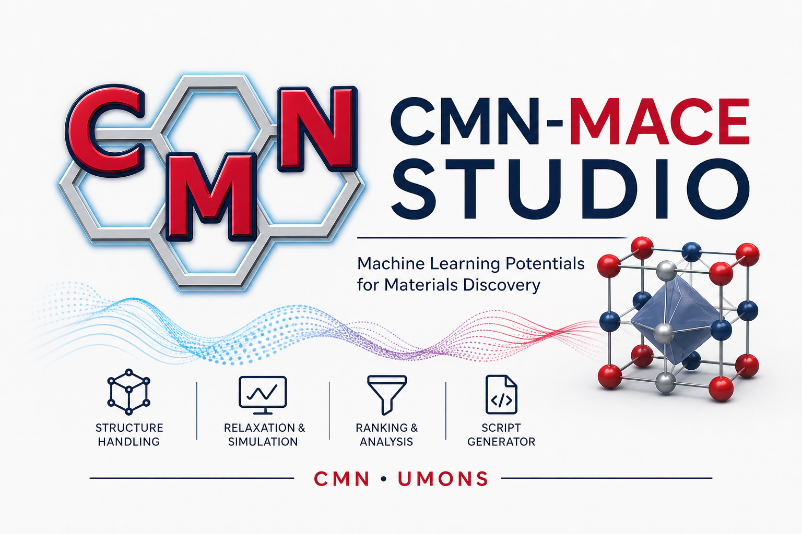

<p align="center">
  
</p>

<h1 align="center">CMN-MACE Studio</h1>
<p align="center">
  <b>Machine Learning Potentials for Materials Discovery</b><br>
  Research-grade atomistic simulation platform · ASE + MACE<br>
  <a href="https://www.umons.ac.be">CMN · UMONS</a>
</p>

<p align="center">
  
  
  
  
  
</p>

---

## Overview

**CMN-MACE Studio** is an interactive web application for running atomistic simulations using the [MACE](https://github.com/ACEsuit/mace) machine-learning interatomic potential within [ASE](https://wiki.fysik.dtu.dk/ase/). It targets researchers in computational materials science who need a fast, configurable, and reproducible workflow — from structure upload to HPC submission — without writing code from scratch.

---

## Features

| Phase | Feature |
|-------|---------|
| 1 | File upload — POSCAR/CONTCAR, CIF, XYZ, Extended XYZ, `.traj` |
| 1 | Structure summary — formula, unit cell, species, PBC |
| 1 | MACE-MP calculator — small / medium / large / custom model |
| 1 | Single-point energy & forces |
| 1 | Geometry optimisation — FIRE / BFGS / LBFGS + optional cell relaxation |
| 1 | Molecular dynamics — NVT (Langevin) and NVE (VelocityVerlet) |
| 1 | Interactive Plotly plots — convergence, MD trajectory |
| 1 | CSV export of all results |
| 2 | Automatic bulk / slab classification |
| 2 | Smart parameter suggestions |
| 3 | Batch "Generate → Relax → Rank" workflow — two-step protocol + energy ranking |
| 4 | HPC export — `run_mace.py` + `submit.slurm` generator |

---

## Project Structure

```
cmn-mace-studio/
├── app.py              # Main Streamlit application
├── config.py           # App-wide constants and defaults
├── logo.png            # CMN-MACE Studio logo
├── requirements.txt    # Python dependencies
└── modules/
    ├── structure.py    # load_structure, classify_structure, suggest_parameters
    ├── calculator.py   # get_calculator (cached), detect_device
    ├── simulation.py   # run_single_point, run_optimization, run_md
    ├── batch.py        # batch_relax_and_rank
    ├── codegen.py      # generate_script, generate_slurm
    └── visualization.py
```

---

## Installation

### Option A — conda (recommended, works on all platforms)

```bash
# 1. Clone the repository
git clone https://github.com/<your-org>/cmn-mace-studio.git
cd cmn-mace-studio

# 2. Create and activate the conda environment
conda create -n mace python=3.11 -y
conda activate mace

# 3. Install MACE and ASE (conda resolves native dependencies automatically)
conda install -c conda-forge mace-torch ase -y

# 4. Install the remaining Python packages
pip install streamlit plotly pandas

# 5. Launch the app
streamlit run app.py
```

### Option B — pip (Linux / macOS)

```bash
git clone https://github.com/<your-org>/cmn-mace-studio.git
cd cmn-mace-studio
pip install -r requirements.txt
streamlit run app.py
```

> **Windows users:** `matscipy` (required by MACE) needs a C compiler on Windows.  
> Use **Option A (conda)** to avoid this. If you see a MACE warning in the sidebar, the UI still works — only calculations are disabled until MACE is installed.

---

## Quick Start

1. Open **http://localhost:8501** after launching the app.
2. **Sidebar** — select a MACE model (small / medium / large) and click **Load Calculator**.
3. **Structure tab** — upload your structure file (POSCAR, CIF, XYZ, or `.traj`).
4. **Simulate tab** — choose a mode (Single Point, Geometry Optimisation, or MD) and run.
5. **Batch Workflow tab** — upload multiple structures for automated relaxation and energy ranking.
6. **HPC Export tab** — generate `run_mace.py` and `submit.slurm` scripts for your cluster.

---

## Requirements

| Package | Min. version |
|---------|-------------|
| Python  | 3.10 |
| streamlit | 1.35.0 |
| ase | 3.22.1 |
| mace-torch | 0.3.6 |
| torch | 2.0.0 |
| plotly | 5.17.0 |
| pandas | 2.0.0 |
| numpy | 1.24.0 |

---


## License

MIT License — see [LICENSE](LICENSE) for details.

<p align="center">Developed by Dr. Israel C. Ribeiro (israelcristian.DACUNHARIBEIRO@umons.ac.be) at <b>CMN · UMONS</b> — Chimie des Matériaux Nouveaux, University of Mons, Belgium.</p>
 
